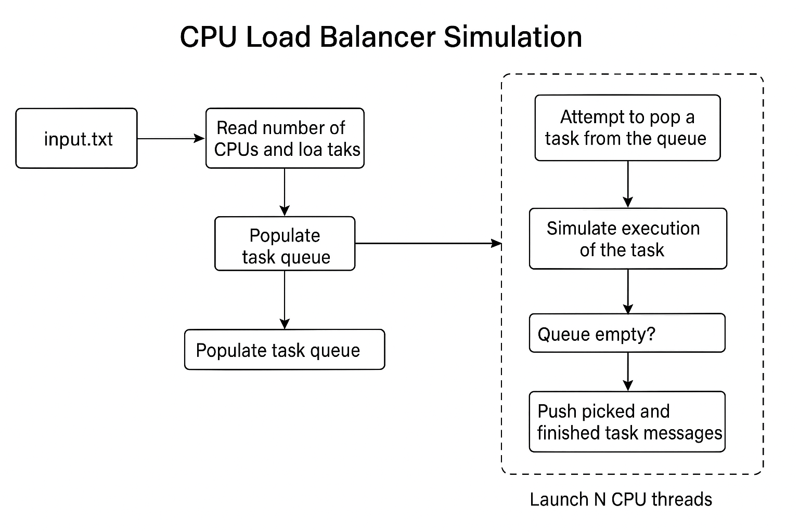

---

##  What is Load Balancing in This Context?

In real-world systems, **load balancing** is about distributing tasks (or loads) across multiple workers (like CPU cores or threads) such that:

* No one CPU is idle while tasks are pending
* Tasks are handled fairly and efficiently
* The overall execution time is minimized

In this simulation, we model that using **threads (workers)** and **a shared queue of tasks**.

---

##  Step-by-Step Flow of the Simulation

###  Step 1: Read the Configuration File

* The program opens `input.txt`.
* First line: Reads the number of available CPUs (e.g., `CPUs: 3` → 3 threads).
* Next lines: Reads tasks like `T1: Load 4` and stores them in a **shared task queue** as pairs (`<task_id, load>`).

```cpp
taskQueue.push({taskId, load});
```

---

###  Step 2: Create CPU Workers (Threads)

* It creates N threads (where N = number of CPUs).
* Each thread simulates a CPU core.

```cpp
for (int i = 0; i < numWorkers; ++i)
    workers.emplace_back(cpuWorker, i + 1);
```

---

###  Step 3: Each CPU Thread Repeatedly Picks Tasks

Each thread runs this loop:

```cpp
while (true) {
    lock queue
    if queue is empty → break
    pop one task
    unlock queue
    simulate load
}
```

Let’s break that down:

####  a. Lock the Queue (mutex)

* Since all threads share the `taskQueue`, we use a `std::mutex` to **avoid race conditions**.
* Only one thread can **pop a task** at a time.

####  b. Pick a Task

* If queue is **not empty**, the thread takes the first task (FIFO).
* It logs: `CPU-1 picked Task T1 (Load: 3)`

####  c. Unlock the Queue

* After picking a task, it releases the lock so that **other CPUs can also pick the next tasks**.

####  d. Simulate Task Execution

* It **sleeps for `load` seconds**, representing how long this task would take.

```cpp
std::this_thread::sleep_for(std::chrono::seconds(currentTask.second));
```

* Then it logs: `CPU-1 finished Task T1`

---

###  Step 4: Continue Until All Tasks Are Done

* Each CPU (thread) keeps repeating:

  * Lock → Pick → Unlock → Execute
* When the queue is finally empty, the CPU breaks the loop and the thread ends.

---

###  Step 5: Join All Threads

* The `main()` thread waits for all CPU threads to complete.

```cpp
for (auto& thread : workers)
    thread.join();
```

* Finally, it prints `All tasks completed.`

---

##  How Load Balancing is Achieved?

It’s achieved **automatically via cooperative work-stealing**:

| Task | Load (sec) | Picked By | CPU Time |
| ---- | ---------- | --------- | -------- |
| T1   | 3          | CPU-1     |          |
| T2   | 5          | CPU-2     |          |
| T3   | 2          | CPU-3     |          |
| T4   | 4          | CPU-3     | After T3 |
| T5   | 1          | CPU-1     | After T1 |

* CPUs that finish early **pick up the next available task**, helping balance the load.
* There’s **no central scheduler** — the CPUs **pull work** as they finish, making it **dynamic and decentralized**, which is a basic form of **work stealing**.
* This avoids idle time and improves parallel efficiency.

---

##  Real-World Parallelism Insight

* In real systems (OS, web servers, etc.), threads/processes take work from a queue.
* The system is considered **balanced** when all workers are busy and finish roughly at the same time.

---

##  What Students Learn From This

* Basics of multithreading and synchronization
* Concept of task queues and producer-consumer problems
* Lock-based access to shared resources
* Decentralized load balancing logic
* How threads can simulate real-world CPU behavior

---



